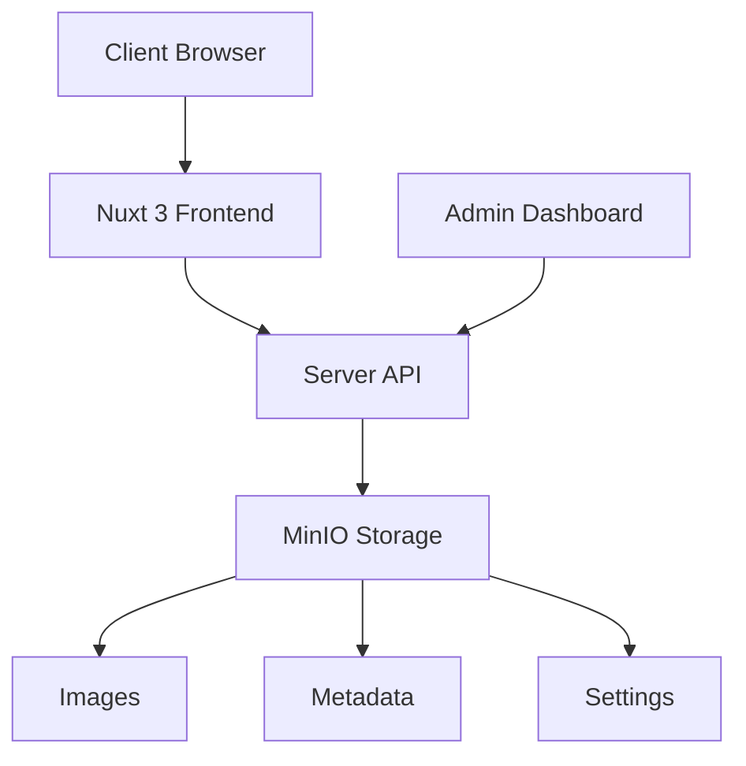

# Wedding Wall 🎊

[](https://nuxt.com)
[](https://vuejs.org)
[](https://www.typescriptlang.org)
[](https://element-plus.org)
[](https://www.docker.com)
[](LICENSE)

A modern wedding blessing wall and photo gallery system built with Nuxt 3, Element Plus, and MinIO. Perfect for creating an interactive digital experience at weddings where guests can share photos and blessings in real-time.

[English](README.md) | [中文](README.zh-TW.md)

## ✨ Features

### 🎨 Multiple Wall Styles

- **Classic Wall** - Traditional carousel with elegant transitions
- **Instagram Style** - Social media inspired with heart interactions
- **Stories Style** - Mobile-friendly vertical format
- **Magazine Style** - Editorial layout with sophisticated design
- **Polaroid Style** - Retro instant photo aesthetic with 3D effects

### 🛡️ Smart Moderation System

- Auto-approval with keyword filtering
- Manual review dashboard
- Flexible display controls
- Real-time content filtering

### 📱 Responsive Design

- Mobile-first approach
- Touch-friendly interfaces
- Optimized for all devices
- Progressive Web App ready

## 🚀 Quick Start

### Prerequisites

- Node.js 18+
- Docker & Docker Compose
- 2GB+ free disk space

### 1. Clone & Install

```bash
git clone https://github.com/yourusername/wedding-wall.git
cd wedding-wall
npm install
```

### 2. Start with Docker Compose

```bash
docker-compose up -d
```

This will start:
- Wedding Wall app on `http://localhost:3000`
- MinIO storage on `http://localhost:9000`
- MinIO Console on `http://localhost:9001` (admin/admin123)

### 3. Manual Setup (Alternative)

If you prefer manual setup:

```bash
# Start MinIO
docker run -p 9000:9000 -p 9001:9001 \
  -e "MINIO_ROOT_USER=admin" \
  -e "MINIO_ROOT_PASSWORD=admin123" \
  -v minio_data:/data \
  quay.io/minio/minio server /data --console-address ":9001"

# Create buckets
# Visit http://localhost:9001 and create:
# - wedding-wall (public)
# - wedding-background (public)

# Start development server
npm run dev
```

## 🎯 Usage

### For Wedding Guests

1. Visit the upload page
2. Enter your name
3. Upload a photo (optional)
4. Write a blessing message
5. Submit and see it appear on the wall!

### For Wedding Hosts

1. Set up the system before the wedding
2. Share QR code with guests
3. Display the wall on a big screen
4. Download all photos after the event

### For Administrators

1. Access `/admin` dashboard
2. Configure moderation settings
3. Review and approve messages
4. Customize wall appearance
5. Upload background images

## 🏗️ Architecture



### Tech Stack

**Frontend**
- Nuxt 3 - Full-stack Vue framework
- Element Plus - UI component library
- TypeScript - Type safety
- Pinia - State management
- Swiper.js - Carousel effects

**Backend**
- Nitro - Nuxt's server engine
- MinIO - S3-compatible object storage
- Formidable - File upload handling

**DevOps**
- Docker & Docker Compose
- GitHub Actions ready
- Environment-based config

## 📁 Project Structure

```
wedding-wall/
├── 📁 components/          # Reusable Vue components
├── 📁 composables/         # Composition utilities
├── 📁 pages/              # Route pages
├── 📁 server/             # Backend API
│   ├── 📁 api/           # API endpoints
│   └── 📁 utils/         # Server utilities
├── 📁 stores/             # Pinia stores
├── 📁 public/             # Static assets
├── 📄 docker-compose.yml  # Docker configuration
├── 📄 Dockerfile         # Container image
├── 📄 nuxt.config.ts     # Nuxt configuration
└── 📄 package.json       # Dependencies
```

## 🔧 Configuration

### Environment Variables

Create a `.env` file:

```env
# MinIO Configuration
MINIO_ENDPOINT=localhost
MINIO_PORT=9000
MINIO_USE_SSL=false
MINIO_ACCESS_KEY=admin
MINIO_SECRET_KEY=admin123
MINIO_BUCKET_NAME=wedding-wall

# App Configuration
NUXT_PUBLIC_API_BASE=/api
```

### Admin Settings

Access `/admin` to configure:
- **Auto-approval** - Enable/disable automatic approval
- **Keywords** - Set auto-approve/reject keywords
- **Display** - Show/hide unmoderated content
- **Appearance** - Customize titles and colors
- **Background** - Upload custom backgrounds
- **Timing** - Adjust carousel intervals

## 🚢 Deployment

### Production Build

```bash
# Build for production
npm run build

# Preview production build
npm run preview
```

### Docker Production

```bash
# Build and run with Docker
docker build -t wedding-wall .
docker run -p 3000:3000 wedding-wall
```

### Deploy to Cloud

The project is ready for deployment on:
- Vercel (recommended for Nuxt)
- Railway
- Fly.io
- Any Docker-compatible platform

## 🛠️ Development

### Commands

```bash
npm run dev      # Start dev server
npm run build    # Build for production
npm run preview  # Preview production build
npm run lint     # Lint code
npm run typecheck # TypeScript check
```

### Contributing

1. Fork the repository
2. Create your feature branch (`git checkout -b feature/AmazingFeature`)
3. Commit your changes (`git commit -m 'Add some AmazingFeature'`)
4. Push to the branch (`git push origin feature/AmazingFeature`)
5. Open a Pull Request

## 🐛 Troubleshooting

<details>
<summary>Common Issues</summary>

### MinIO Connection Failed

- Check if Docker containers are running: `docker ps`
- Verify ports 9000/9001 are not in use
- Check MinIO logs: `docker logs wedding-wall-minio`

### Upload Errors

- Verify file size (max 10MB by default)
- Check file format (images only)
- Ensure MinIO buckets exist

### Gallery Not Loading

- Clear browser cache
- Check browser console for errors
- Verify API endpoints are accessible

</details>

## 📝 API Documentation

<details>
<summary>API Endpoints</summary>

### Public Endpoints

- `GET /api/messages` - Get approved messages
- `POST /api/upload` - Upload photo and message
- `GET /api/image/:name` - Get image file
- `GET /api/background-image` - Get background URL

### Admin Endpoints

- `GET /api/admin/messages` - Get all messages
- `POST /api/admin/approve` - Approve/reject messages
- `GET /api/admin/settings` - Get settings
- `POST /api/admin/settings` - Update settings

</details>

## 📄 License

This project is licensed under the MIT License - see the [LICENSE](LICENSE) file for details.

## 🙏 Acknowledgments

- Built with [Nuxt 3](https://nuxt.com)
- UI powered by [Element Plus](https://element-plus.org)
- Storage by [MinIO](https://min.io)
- Icons from [Element Plus Icons](https://element-plus.org/en-US/component/icon.html)

---

<div align="center">

**[Documentation](https://github.com/yourusername/wedding-wall/wiki)** | **[Report Bug](https://github.com/yourusername/wedding-wall/issues)**

Made with ❤️ for couples everywhere

</div>