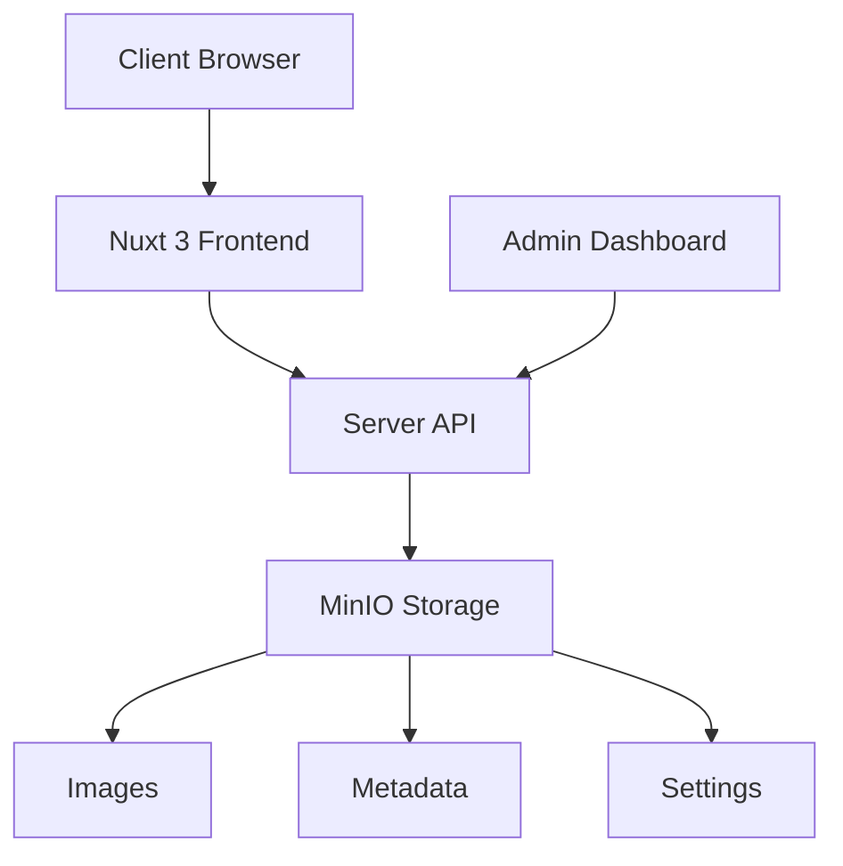

# Wedding Wall 🎊

[](https://nuxt.com)
[](https://vuejs.org)
[](https://www.typescriptlang.org)
[](https://element-plus.org)
[](https://www.docker.com)
[](LICENSE)

A modern wedding blessing wall and photo gallery system built with Nuxt 3, Element Plus, and MinIO. Perfect for creating an interactive digital experience at weddings where guests can share photos and blessings in real-time.

[English](#english) | [中文](#中文)


## ✨ Features

### 🎨 Multiple Wall Styles
- **Classic Wall** - Traditional carousel with elegant transitions
- **Instagram Style** - Social media inspired with heart interactions
- **Stories Style** - Mobile-friendly vertical format
- **Magazine Style** - Editorial layout with sophisticated design
- **Polaroid Style** - Retro instant photo aesthetic with 3D effects

### 🛡️ Smart Moderation System
- Auto-approval with keyword filtering
- Manual review dashboard
- Flexible display controls
- Real-time content filtering

### 📱 Responsive Design
- Mobile-first approach
- Touch-friendly interfaces
- Optimized for all devices
- Progressive Web App ready

## 🚀 Quick Start

### Prerequisites
- Node.js 18+
- Docker & Docker Compose
- 2GB+ free disk space

### 1. Clone & Install

```bash
git clone https://github.com/yourusername/wedding-wall.git
cd wedding-wall
npm install
```

### 2. Start with Docker Compose

```bash
docker-compose up -d
```

This will start:
- Wedding Wall app on http://localhost:3000
- MinIO storage on http://localhost:9000
- MinIO Console on http://localhost:9001 (admin/admin123)

### 3. Manual Setup (Alternative)

If you prefer manual setup:

```bash
# Start MinIO
docker run -p 9000:9000 -p 9001:9001 \
  -e "MINIO_ROOT_USER=admin" \
  -e "MINIO_ROOT_PASSWORD=admin123" \
  -v minio_data:/data \
  quay.io/minio/minio server /data --console-address ":9001"

# Create buckets
# Visit http://localhost:9001 and create:
# - wedding-wall (public)
# - wedding-background (public)

# Start development server
npm run dev
```

## 🎯 Usage

### For Wedding Guests
1. Visit the upload page
2. Enter your name
3. Upload a photo (optional)
4. Write a blessing message
5. Submit and see it appear on the wall!

### For Wedding Hosts
1. Set up the system before the wedding
2. Share QR code with guests
3. Display the wall on a big screen
4. Download all photos after the event

### For Administrators
1. Access `/admin` dashboard
2. Configure moderation settings
3. Review and approve messages
4. Customize wall appearance
5. Upload background images

## 🏗️ Architecture



### Tech Stack

**Frontend**
- Nuxt 3 - Full-stack Vue framework
- Element Plus - UI component library
- TypeScript - Type safety
- Pinia - State management
- Swiper.js - Carousel effects

**Backend**
- Nitro - Nuxt's server engine
- MinIO - S3-compatible object storage
- Formidable - File upload handling

**DevOps**
- Docker & Docker Compose
- GitHub Actions ready
- Environment-based config

## 📁 Project Structure

```
wedding-wall/
├── 📁 components/          # Reusable Vue components
├── 📁 composables/         # Composition utilities
├── 📁 pages/              # Route pages
├── 📁 server/             # Backend API
│   ├── 📁 api/           # API endpoints
│   └── 📁 utils/         # Server utilities
├── 📁 stores/             # Pinia stores
├── 📁 public/             # Static assets
├── 📄 docker-compose.yml  # Docker configuration
├── 📄 Dockerfile         # Container image
├── 📄 nuxt.config.ts     # Nuxt configuration
└── 📄 package.json       # Dependencies
```

## 🔧 Configuration

### Environment Variables

Create a `.env` file:

```env
# MinIO Configuration
MINIO_ENDPOINT=localhost
MINIO_PORT=9000
MINIO_USE_SSL=false
MINIO_ACCESS_KEY=admin
MINIO_SECRET_KEY=admin123
MINIO_BUCKET_NAME=wedding-wall

# App Configuration
NUXT_PUBLIC_API_BASE=/api
```

### Admin Settings

Access `/admin` to configure:
- **Auto-approval** - Enable/disable automatic approval
- **Keywords** - Set auto-approve/reject keywords
- **Display** - Show/hide unmoderated content
- **Appearance** - Customize titles and colors
- **Background** - Upload custom backgrounds
- **Timing** - Adjust carousel intervals

## 🚢 Deployment

### Production Build

```bash
# Build for production
npm run build

# Preview production build
npm run preview
```

### Docker Production

```bash
# Build and run with Docker
docker build -t wedding-wall .
docker run -p 3000:3000 wedding-wall
```

### Deploy to Cloud

The project is ready for deployment on:
- Vercel (recommended for Nuxt)
- Railway
- Fly.io
- Any Docker-compatible platform

## 🛠️ Development

### Commands

```bash
npm run dev      # Start dev server
npm run build    # Build for production
npm run preview  # Preview production build
npm run lint     # Lint code
npm run typecheck # TypeScript check
```

### Contributing

1. Fork the repository
2. Create your feature branch (`git checkout -b feature/AmazingFeature`)
3. Commit your changes (`git commit -m 'Add some AmazingFeature'`)
4. Push to the branch (`git push origin feature/AmazingFeature`)
5. Open a Pull Request

## 📸 Screenshots

<details>
<summary>View Screenshots</summary>

### Home Page


### Upload Form


### Wall Styles


### Admin Dashboard


</details>

## 🐛 Troubleshooting

<details>
<summary>Common Issues</summary>

### MinIO Connection Failed
- Check if Docker containers are running: `docker ps`
- Verify ports 9000/9001 are not in use
- Check MinIO logs: `docker logs wedding-wall-minio`

### Upload Errors
- Verify file size (max 10MB by default)
- Check file format (images only)
- Ensure MinIO buckets exist

### Gallery Not Loading
- Clear browser cache
- Check browser console for errors
- Verify API endpoints are accessible

</details>

## 📝 API Documentation

<details>
<summary>API Endpoints</summary>

### Public Endpoints
- `GET /api/messages` - Get approved messages
- `POST /api/upload` - Upload photo and message
- `GET /api/image/:name` - Get image file
- `GET /api/background-image` - Get background URL

### Admin Endpoints
- `GET /api/admin/messages` - Get all messages
- `POST /api/admin/approve` - Approve/reject messages
- `GET /api/admin/settings` - Get settings
- `POST /api/admin/settings` - Update settings

</details>

## 📄 License

This project is licensed under the MIT License - see the [LICENSE](LICENSE) file for details.

## 🙏 Acknowledgments

- Built with [Nuxt 3](https://nuxt.com)
- UI powered by [Element Plus](https://element-plus.org)
- Storage by [MinIO](https://min.io)
- Icons from [Element Plus Icons](https://element-plus.org/en-US/component/icon.html)

---

<div align="center">

**[Demo](https://wedding-wall-demo.vercel.app)** | **[Documentation](https://github.com/yourusername/wedding-wall/wiki)** | **[Report Bug](https://github.com/yourusername/wedding-wall/issues)**

Made with ❤️ for couples everywhere

</div>

---

# 中文

# 婚禮祝福牆 🎊

一個使用 Nuxt 3、Element Plus 與 MinIO 打造的現代化婚禮祝福牆相簿系統。專為婚禮打造的互動式數位體驗，讓賓客能即時分享照片與祝福。

## ✨ 主要功能

### 🎨 多樣化祝福牆風格
- **經典祝福牆** - 傳統輪播模式，穩重典雅
- **Instagram 風格** - 社群媒體風格，愛心互動
- **Stories 風格** - 動態故事般體驗，手機比例
- **Magazine 風格** - 雜誌排版精緻感
- **Polaroid 風格** - 復古拍立得質感，3D 輪播

### 🛡️ 智能審核系統
- 自動審核與關鍵字過濾
- 手動審核控制台
- 彈性顯示控制
- 即時內容過濾

### 📱 響應式設計
- 行動優先設計
- 觸控友善介面
- 全裝置最佳化
- PWA 支援

## 🚀 快速開始

### 系統需求
- Node.js 18+
- Docker & Docker Compose
- 2GB+ 可用磁碟空間

### 1. 複製專案與安裝

```bash
git clone https://github.com/yourusername/wedding-wall.git
cd wedding-wall
npm install
```

### 2. 使用 Docker Compose 啟動

```bash
docker-compose up -d
```

這將啟動：
- 婚禮祝福牆應用程式：http://localhost:3000
- MinIO 儲存服務：http://localhost:9000
- MinIO 控制台：http://localhost:9001 (admin/admin123)

### 3. 手動設定（替代方案）

如果您偏好手動設定：

```bash
# 啟動 MinIO
docker run -p 9000:9000 -p 9001:9001 \
  -e "MINIO_ROOT_USER=admin" \
  -e "MINIO_ROOT_PASSWORD=admin123" \
  -v minio_data:/data \
  quay.io/minio/minio server /data --console-address ":9001"

# 建立 buckets
# 訪問 http://localhost:9001 並建立：
# - wedding-wall (公開讀取)
# - wedding-background (公開讀取)

# 啟動開發伺服器
npm run dev
```

## 🎯 使用說明

### 給婚禮賓客
1. 訪問上傳頁面
2. 輸入您的姓名
3. 上傳照片（選擇性）
4. 寫下祝福話語
5. 送出後即可在祝福牆看到！

### 給婚禮主辦方
1. 婚禮前設定系統
2. 分享 QR Code 給賓客
3. 將祝福牆投影在大螢幕
4. 活動後下載所有照片

### 給管理員
1. 訪問 `/admin` 控制台
2. 設定審核規則
3. 審核留言內容
4. 自訂外觀樣式
5. 上傳背景圖片

## 📁 專案結構

```
wedding-wall/
├── 📁 components/          # 可重用 Vue 組件
├── 📁 composables/         # 組合式工具
├── 📁 pages/              # 路由頁面
├── 📁 server/             # 後端 API
│   ├── 📁 api/           # API 端點
│   └── 📁 utils/         # 伺服器工具
├── 📁 stores/             # Pinia 狀態管理
├── 📁 public/             # 靜態資源
├── 📄 docker-compose.yml  # Docker 設定
├── 📄 Dockerfile         # 容器映像
├── 📄 nuxt.config.ts     # Nuxt 設定
└── 📄 package.json       # 相依套件
```

## 🔧 設定

### 環境變數

建立 `.env` 檔案：

```env
# MinIO 設定
MINIO_ENDPOINT=localhost
MINIO_PORT=9000
MINIO_USE_SSL=false
MINIO_ACCESS_KEY=admin
MINIO_SECRET_KEY=admin123
MINIO_BUCKET_NAME=wedding-wall

# 應用程式設定
NUXT_PUBLIC_API_BASE=/api
```

### 管理員設定

訪問 `/admin` 進行設定：
- **自動審核** - 啟用/停用自動審核
- **關鍵字** - 設定自動通過/拒絕關鍵字
- **顯示** - 顯示/隱藏未審核內容
- **外觀** - 自訂標題與顏色
- **背景** - 上傳自訂背景
- **時間** - 調整輪播間隔

## 🚢 部署

### 正式環境建置

```bash
# 建置正式版本
npm run build

# 預覽正式版本
npm run preview
```

### Docker 正式環境

```bash
# 建置並執行 Docker
docker build -t wedding-wall .
docker run -p 3000:3000 wedding-wall
```

### 雲端部署

專案已準備好部署至：
- Vercel（Nuxt 推薦）
- Railway
- Fly.io
- 任何支援 Docker 的平台

## 🛠️ 開發

### 指令

```bash
npm run dev      # 啟動開發伺服器
npm run build    # 建置正式版本
npm run preview  # 預覽正式版本
npm run lint     # 程式碼檢查
npm run typecheck # TypeScript 檢查
```

### 貢獻

1. Fork 此專案
2. 建立功能分支 (`git checkout -b feature/AmazingFeature`)
3. 提交變更 (`git commit -m 'Add some AmazingFeature'`)
4. 推送至分支 (`git push origin feature/AmazingFeature`)
5. 開啟 Pull Request

## 📄 授權

此專案採用 MIT 授權 - 詳見 [LICENSE](LICENSE) 檔案。

## 🙏 致謝

- 使用 [Nuxt 3](https://nuxt.com) 建置
- UI 由 [Element Plus](https://element-plus.org) 提供
- 儲存服務 [MinIO](https://min.io)
- 圖示來自 [Element Plus Icons](https://element-plus.org/en-US/component/icon.html)

---

<div align="center">

**[展示](https://wedding-wall-demo.vercel.app)** | **[文件](https://github.com/yourusername/wedding-wall/wiki)** | **[回報問題](https://github.com/yourusername/wedding-wall/issues)**

用 ❤️ 為每對新人打造

</div>