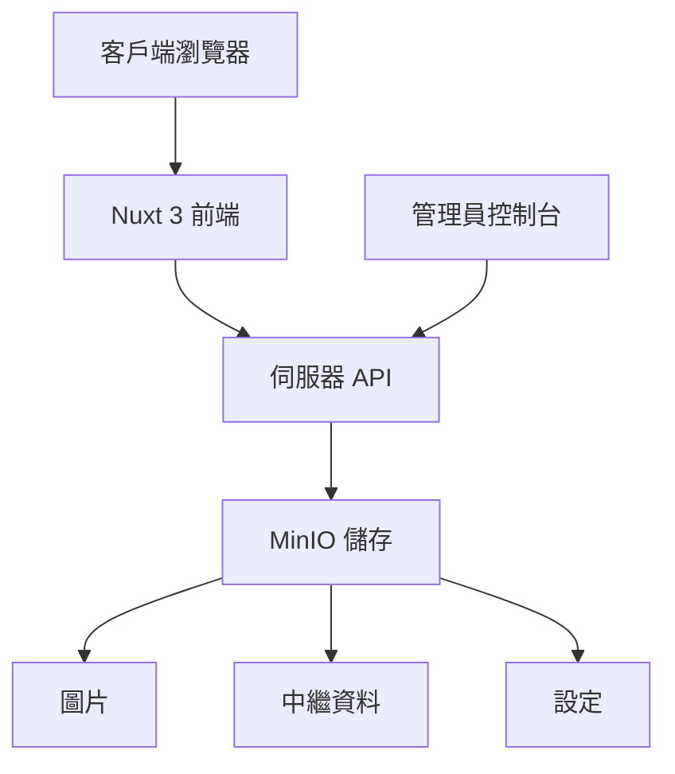

# 婚禮祝福牆 🎊

[](https://nuxt.com)
[](https://vuejs.org)
[](https://www.typescriptlang.org)
[](https://element-plus.org)
[](https://www.docker.com)
[](LICENSE)

一個使用 Nuxt 3、Element Plus 與 MinIO 打造的現代化婚禮祝福牆相簿系統。專為婚禮打造的互動式數位體驗，讓賓客能即時分享照片與祝福。

[English](README.md) | [中文](README.zh-TW.md)

## ✨ 主要功能

### 🎨 多樣化祝福牆風格

- **經典祝福牆** - 傳統輪播模式，穩重典雅
- **Instagram 風格** - 社群媒體風格，愛心互動
- **Stories 風格** - 動態故事般體驗，手機比例
- **Magazine 風格** - 雜誌排版精緻感
- **Polaroid 風格** - 復古拍立得質感，3D 輪播

### 🛡️ 智能審核系統

- 自動審核與關鍵字過濾
- 手動審核控制台
- 彈性顯示控制
- 即時內容過濾

### 📱 響應式設計

- 行動優先設計
- 觸控友善介面
- 全裝置最佳化
- PWA 支援

## 🚀 快速開始

### 系統需求

- Node.js 18+
- Docker & Docker Compose
- 2GB+ 可用磁碟空間

### 1. 複製專案與安裝

```bash
git clone https://github.com/yourusername/wedding-wall.git
cd wedding-wall
npm install
```

### 2. 使用 Docker Compose 啟動

```bash
docker-compose up -d
```

這將啟動：
- 婚禮祝福牆應用程式：`http://localhost:3000`
- MinIO 儲存服務：`http://localhost:9000`
- MinIO 控制台：`http://localhost:9001` (admin/admin123)

### 3. 手動設定（替代方案）

如果您偏好手動設定：

```bash
# 啟動 MinIO
docker run -p 9000:9000 -p 9001:9001 \
  -e "MINIO_ROOT_USER=admin" \
  -e "MINIO_ROOT_PASSWORD=admin123" \
  -v minio_data:/data \
  quay.io/minio/minio server /data --console-address ":9001"

# 建立 buckets
# 訪問 http://localhost:9001 並建立：
# - wedding-wall (公開讀取)
# - wedding-background (公開讀取)

# 啟動開發伺服器
npm run dev
```

## 🎯 使用說明

### 給婚禮賓客

1. 訪問上傳頁面
2. 輸入您的姓名
3. 上傳照片（選擇性）
4. 寫下祝福話語
5. 送出後即可在祝福牆看到！

### 給婚禮主辦方

1. 婚禮前設定系統
2. 分享 QR Code 給賓客
3. 將祝福牆投影在大螢幕
4. 活動後下載所有照片

### 給管理員

1. 訪問 `/admin` 控制台
2. 設定審核規則
3. 審核留言內容
4. 自訂外觀樣式
5. 上傳背景圖片

## 🏗️ 架構設計



### 技術堆疊

**前端**
- Nuxt 3 - 全端 Vue 框架
- Element Plus - UI 組件庫
- TypeScript - 類型安全
- Pinia - 狀態管理
- Swiper.js - 輪播效果

**後端**
- Nitro - Nuxt 的伺服器引擎
- MinIO - S3 相容物件儲存
- Formidable - 檔案上傳處理

**DevOps**
- Docker & Docker Compose
- GitHub Actions 支援
- 環境變數設定

## 📁 專案結構

```
wedding-wall/
├── 📁 components/          # 可重用 Vue 組件
├── 📁 composables/         # 組合式工具
├── 📁 pages/              # 路由頁面
├── 📁 server/             # 後端 API
│   ├── 📁 api/           # API 端點
│   └── 📁 utils/         # 伺服器工具
├── 📁 stores/             # Pinia 狀態管理
├── 📁 public/             # 靜態資源
├── 📄 docker-compose.yml  # Docker 設定
├── 📄 Dockerfile         # 容器映像
├── 📄 nuxt.config.ts     # Nuxt 設定
└── 📄 package.json       # 相依套件
```

## 🔧 設定

### 環境變數

建立 `.env` 檔案：

```env
# MinIO 設定
MINIO_ENDPOINT=localhost
MINIO_PORT=9000
MINIO_USE_SSL=false
MINIO_ACCESS_KEY=admin
MINIO_SECRET_KEY=admin123
MINIO_BUCKET_NAME=wedding-wall

# 應用程式設定
NUXT_PUBLIC_API_BASE=/api
```

### 管理員設定

訪問 `/admin` 進行設定：
- **自動審核** - 啟用/停用自動審核
- **關鍵字** - 設定自動通過/拒絕關鍵字
- **顯示** - 顯示/隱藏未審核內容
- **外觀** - 自訂標題與顏色
- **背景** - 上傳自訂背景
- **時間** - 調整輪播間隔

## 🚢 部署

### 正式環境建置

```bash
# 建置正式版本
npm run build

# 預覽正式版本
npm run preview
```

### Docker 正式環境

```bash
# 建置並執行 Docker
docker build -t wedding-wall .
docker run -p 3000:3000 wedding-wall
```

### 雲端部署

專案已準備好部署至：
- Vercel（Nuxt 推薦）
- Railway
- Fly.io
- 任何支援 Docker 的平台

## 🛠️ 開發

### 指令

```bash
npm run dev      # 啟動開發伺服器
npm run build    # 建置正式版本
npm run preview  # 預覽正式版本
npm run lint     # 程式碼檢查
npm run typecheck # TypeScript 檢查
```

### 貢獻

1. Fork 此專案
2. 建立功能分支 (`git checkout -b feature/AmazingFeature`)
3. 提交變更 (`git commit -m 'Add some AmazingFeature'`)
4. 推送至分支 (`git push origin feature/AmazingFeature`)
5. 開啟 Pull Request

## 🐛 疑難排解

<details>
<summary>常見問題</summary>

### MinIO 連線失敗

- 檢查 Docker 容器是否運行中：`docker ps`
- 確認 9000/9001 連接埠未被占用
- 檢查 MinIO 日誌：`docker logs wedding-wall-minio`

### 上傳錯誤

- 確認檔案大小（預設最大 10MB）
- 檢查檔案格式（僅限圖片）
- 確保 MinIO buckets 已建立

### 相簿無法載入

- 清除瀏覽器快取
- 檢查瀏覽器控制台錯誤
- 確認 API 端點可存取

</details>

## 📝 API 文件

<details>
<summary>API 端點</summary>

### 公開端點

- `GET /api/messages` - 取得已審核訊息
- `POST /api/upload` - 上傳照片和訊息
- `GET /api/image/:name` - 取得圖片檔案
- `GET /api/background-image` - 取得背景網址

### 管理員端點

- `GET /api/admin/messages` - 取得所有訊息
- `POST /api/admin/approve` - 審核訊息
- `GET /api/admin/settings` - 取得設定
- `POST /api/admin/settings` - 更新設定

</details>

## 📄 授權

此專案採用 MIT 授權 - 詳見 [LICENSE](LICENSE) 檔案。

## 🙏 致謝

- 使用 [Nuxt 3](https://nuxt.com) 建置
- UI 由 [Element Plus](https://element-plus.org) 提供
- 儲存服務 [MinIO](https://min.io)
- 圖示來自 [Element Plus Icons](https://element-plus.org/en-US/component/icon.html)

---

<div align="center">

**[文件](https://github.com/yourusername/wedding-wall/wiki)** | **[回報問題](https://github.com/yourusername/wedding-wall/issues)**

用 ❤️ 為每對新人打造

</div>